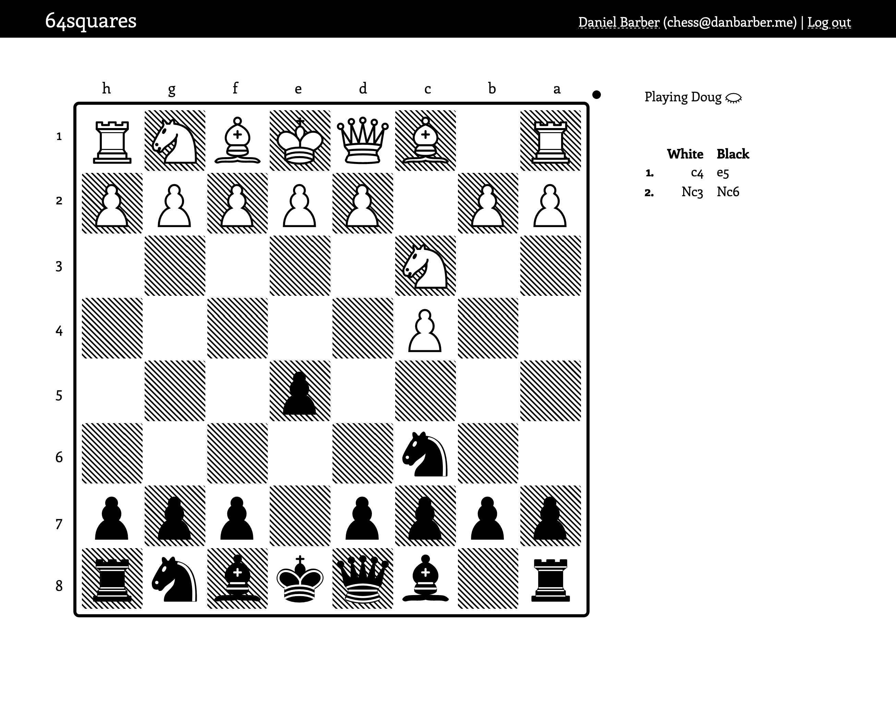
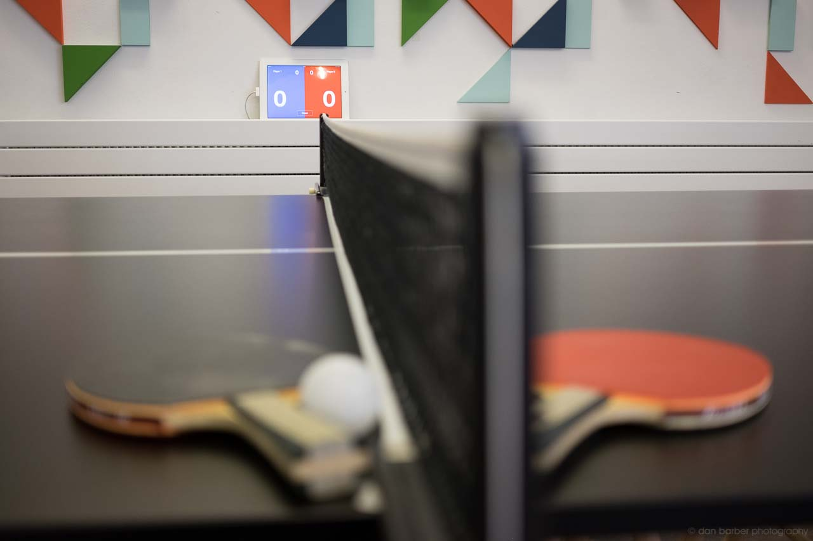
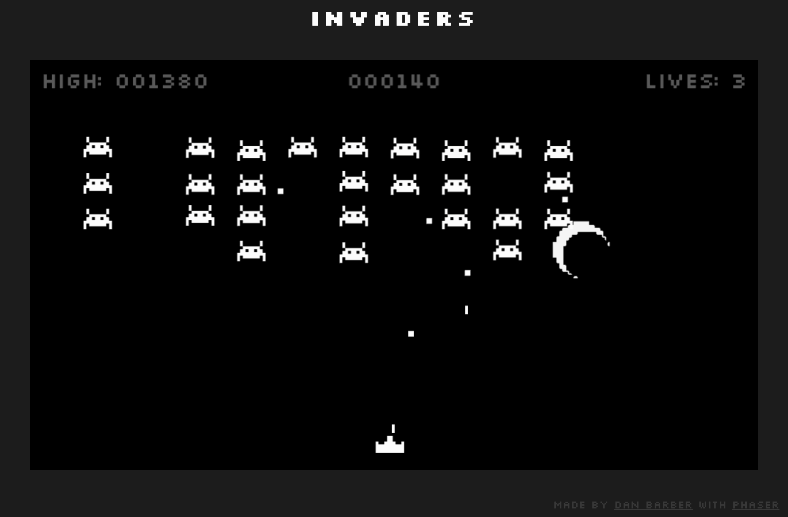
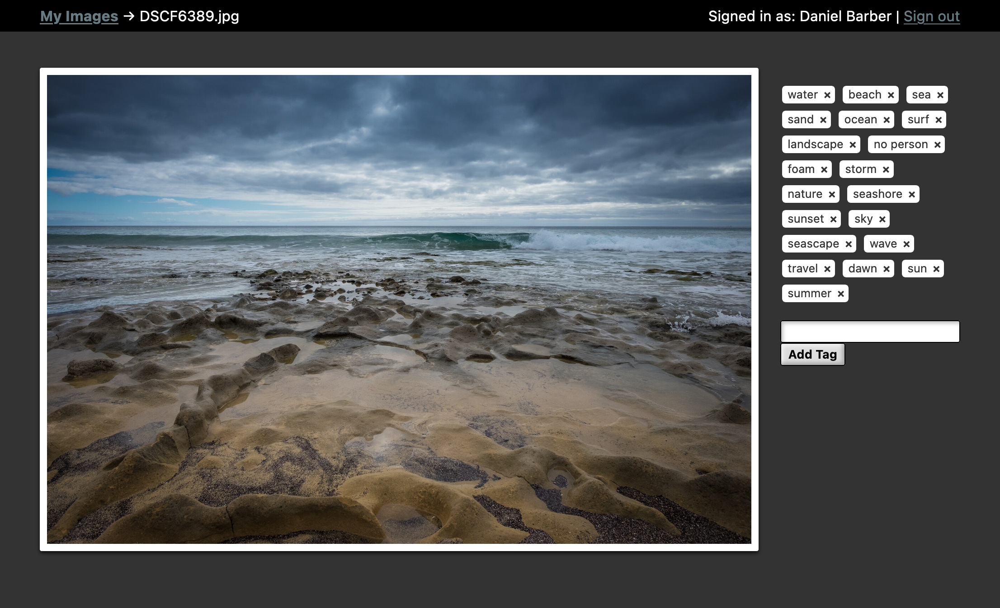

This is a list of projects that I've worked on over the years, in no particular
order.

### 64squares

[64squares](https://64squares.club) is an online, multiplayer chess game written
in Elixir and Phoenix, with a React front end (although I'm partway through
refactoring this into LiveView). It uses websockets via Phoenix channels to
broadcast moves back and forth between players and implements a complete chess
rules engine. The source code is [available on
GitHub](https://github.com/danbee/chess).

I wrote a [blog post about implementing some of the chess rules engine](/2018/08/10/chess-and-recursion-part-1).

### Persephone

[Persephone](https://persephone.fm) is an MPD (Music Player Daemon) client for macOS, written in
Swift/AppKit. It is open source and the source code is [available on
GitHub](https://github.com/danbee/persephone).

### Ping Pong Scoreboard

In 2016, during a thoughtbot London hackathon, myself and my collegue Damien
Tanner [implemented a scoreboard system for our ping pong table](https://thoughtbot.com/blog/building-a-ping-pong-scoreboard).
This involved a nice mix of hardware hacking, [hardware code](https://gist.github.com/danbee/820a17d0aa75f8900250),
and [simple web development](https://github.com/danbee/scoreboard).

### Invaders

[Invaders](https://invaders.danbee.in) was written in JavaScript using Phaser.js
for a New Bamboo hack day in 2014. The source is [available on GitHub](https://github.com/danbee/invaders/tree/master).

### My Images

[My Images](https://github.com/danbee/my-images) is a simple image storage
application built in Rails with Dragonfly for image storage/processing. The
current version uses Clarifai to automatically tag images using AI.

### Mandelbrot Shader

<figure>
  <canvas class="glslCanvas shader" data-fragment-url="lib/mandelbrot.frag" width="1200" height="675"></canvas>
</figure>

I've long been interested in fractals, particularly the Mandelbrot set. I used
to spend hours playing with Fractint on early PC's. A few years ago I realised
that GPU hardware would be ideal for calculating fractals due to the massive
paralellism they offer. This was my attempt to implement that with a [GLSL
shader](https://github.com/danbee/shaders/blob/master/mandelbrot.frag).

